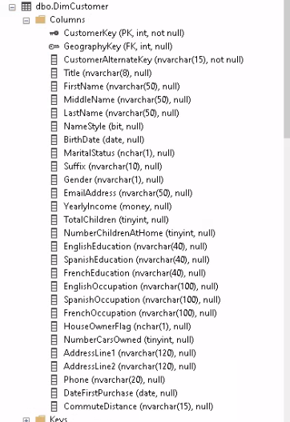

How to copy a table from an on-premise server to Azure Data Factory using a self-hosted integration runtime.

This tutorial simulates an on-prem environment by creating two servers in the same network.

* One has SQL Server
* The other server has a self-hosted integration runtime (IR) installed to connect to Azure.

Workflow:

* The on-prem IR server connects to the on-prem SQL server to query tables
* It copies the tables to Azure Blob Storage through Azure Data Factory using Parquet files.
* These files are copied to Azure SQL Database for data warehouse.
* Then Power BI connects to this database to create reporting.

## Database example

As seen in [Create a SQL Server Windows VM](../azure-sql-server-vm/).

Using `AdventureWorksDW2019` from [this](https://learn.microsoft.com/en-us/sql/samples/adventureworks-install-configure?view=sql-server-ver16&tabs=ssms) Microsoft doc.

**Explore the table to copy to Azure**

For this tutorial I am going to copy the table `dbo.DimCustomer` which has the following schema:

I am only going to keep these columns:

    CustomerKey (PK, int)
    GeographyKey (FK, int)
    CustomerAlternateKey (nvarchar(15))
    FirstName (nvarchar(50))
    LastName (nvarchar(50))
    MaritalStatus (nchar(1))
    EmailAddress (nvarchar(50))
    YearlyIncome (money)
    TotalChildren (tinyint)
    HouseOwnerFlag (nchar(1))
    NumberCarsOwned (tinyint)
    AddressLine1 (nvarchar(120))
    Phone (nvarchar(20))
    DateFirstPurchase (date)
    CommuteDistance (nvarchar(15))

## Setup: Self-Hosted Integration Runtime

Follow [Azure Data Factory Self-Hosted Integration Runtime](../azure-adf-self-hosted-integration-runtime/) to setup two servers that simulate an on-premise private network. You can follow that guide to setup the integration runtime in your actual on-premise network.

* Create a resource group, network security group, and virtual network
  * [Azure Resource Group and Network Security Group](../azure-rg-nsg/)
  * [Azure Virtual Network](../azure-virtual-network/)
* Create a Windows Server SQL Server VM connected to this Vnet
  * [Create a SQL Server Windows VM](../azure-sql-server-vm/)
* Create a Windows Server VM connected to the same Vnet
  * [Create an Azure Windows Server Datacenter VM](../azure-windows-server-datacenter-vm/)
* Install the Self-Hosted Integration Runtime to the Windows Server VM
  * [Azure Data Factory Self-Hosted Integration Runtime](../azure-adf-self-hosted-integration-runtime/)
* Create a Data Factory and create a Self-Hosted Integration Runtime
* Connect the Windows Server VM to this Integration Runtime

## Setup: Azure resources for this tutorial

Create these resources under the same subscription, resource group, and location:

**Resources**

* [Create an Azure Blob Storage and Container](../azure-blob-storage-container/)
* [Create an Azure SQL Database](../azure-sql-database/)

**Linked Services**

[Azure Data Factory Linked Services](../azure-data-factory-linked-service/) for:

* On-premise SQL Server
* Blob Storage
* Azure SQL Database

**Datasets**

[Azure Data Factory Datasets](../azure-data-factory-dataset/) for the corresponding Linked Services.

* On-premise SQL Server
  * In `Table name` selected `DimCustomer`
* Blob Storage (Parquet)
* Azure SQL Database

## Create the table in Azure SQL Database

Create the table in Azure SQL Database to map the table from SQL Server. (Alternatively, when using a `Copy data` from Blob to Azure SQL, in the `Sink` set to `Auto create table` for the first run, however all columns are created with `nvarchar`)

**Get the query used to create the table `dbo.DimCustomer` in SQL Server**

* Connect to the Server with the Self-Hosted Integration Runtime.
* Open SSMS
* Connect to the DB `AdventureWorksDW2019`
* Right click the table `dbo.DimCustomer`
* Select `Script table as / Create to / Clipboard`
* Use `Ctrl V` to paste the query to Notepad++

**Open `Azure Data Studio` and connect to the Azure SQL Database**

Run the query:

    CREATE TABLE DimCustomer(
        CustomerKey int PRIMARY KEY,
        GeographyKey int NULL,
        CustomerAlternateKey nvarchar(15) NOT NULL,
        FirstName nvarchar(50) NULL,
        LastName nvarchar(50) NULL,
        MaritalStatus nchar(1) NULL,
        EmailAddress nvarchar(50) NULL,
        YearlyIncome money NULL,
        TotalChildren tinyint NULL,
        HouseOwnerFlag nchar(1) NULL,
        NumberCarsOwned tinyint NULL,
        AddressLine1 nvarchar(120) NULL,
        Phone nvarchar(20) NULL,
        DateFirstPurchase date NULL,
        CommuteDistance nvarchar(15) NULL,
    );
    GO

## Pipeline for the Data Factory

* In the Data Factory, Author hub
* On `Pipelines` click on `New pipeline`
* Name it `OnpremSQL to AzureSQL`

## Copy Activity to connect from SQL Server to Blob

* Under `Activities` in `Move & Transform`
* Drag/drop `Copy data` to the empty canvas
* Name it `OnpremSQL to Blob`

**Set the Source**

* `Source dataset`: The dataset for the SQL Server
* Use query set to `Table`
  * Other options: Query, Stored procedure
* Query timeout (minutes) `120` (default)
  * `Timeout for query command execution, default is 120 minutes. If parameter is set for this property, allowed values are timespan, such as "02:00:00" (120 minutes).`
* Isolation level `None` (default)
  * `Specifies the transaction locking behavior for the SQL source. The allowed values are: ReadCommitted, ReadUncommitted, RepeatableRead, Serializable, Snapshot`
  * See docs [here](https://learn.microsoft.com/en-us/dotnet/api/system.data.isolationlevel?view=net-7.0)
* Partition option `None`
  * Other options
    * Physical partitions of table
      * `When using physical partition, ADF will auto determine the partition column and mechanism based on your physical table definition.`
    * Dynamic range
      * `When using query with parallel enabled, range partition parameter(?AdfDynamicRangePartitionCondition) is needed. Sample query: SELECT * FROM <TableName> WHERE ?AdfDynamicRangePartitionCondition`
* Click on `Preview Data` to validate settings before triggering a run or publishing the pipeline
  * It shows an overlay with `dbo.DimCustomer`

**Set the Sink**

* `Sink dataset`: The dataset for the Blob Storage
* Copy behavior `None`
  * Other options: Add dynamic content, Flatten hierarchy, Merge files, Preserve hierarchy
  * `Specify behavior when copying files between file systems.`
* Max concurrent connections `no value`
  * `The upper limit of concurrent connections established to the data store during the activity run. Specify a value only when you want to limit concurrent connections.`
* Block size (MB) `no value`
  * `Specify the block size in MB when writing data to Azure Blob Storage. Allowed value is between 4 and 100 MB.`
* Metadata `no value`
  * `Specify the custom metadata with metadata key and value.`
* Max rows per file `no value`
  * `When writing data into a folder, you can choose to write to multiple files and specify the max rows per file.`

**Set Mapping**

* Type conversion settings
  * Allow data truncation `Enabled` (default)
    * `Allow data truncation when converting source data to sink with different type during copy, e.g. from decimal to integer, from DatetimeOffset to Datetime.`
  * Other settings:
    * Treat boolean as number
      * `Treat boolean as number, e.g. true as 1.`
    * DateTime format
      * `Format string when converting between dates without time zone offset and strings, e.g. "yyyy-MM-dd HH:mm:ss.fff"`
    * DateTimeOffset format
    * TimeSpan format
      * `Format string when converting between time periods and strings, e.g. "dd\.hh\:mm\:ss"`
    * Culture
      * `Culture information to be used when convert types, e.g. "en-us", "fr-fr".`
* Click `Import Schemas`
  * Remove columns that aren't needed
    * Click on `Preview source` (overlay)
    * Remove columns on the mapping

**Settings tab**

* `You will be charged # of used DIUs * copy duration * $0.25/DIU-hour`
* Maximum data integration unit
  * Default is `Auto` (4). Change to `2`
* Other options (no values by default)
  * Degree of copy parallelism
    * `Specify the degree of parallelism that data loading would use.`
  * Data consistency verification
    * `When selecting this option, copy activity will do additional data consistency verification between source and destination store after data movement. The verification includes file size check and checksum verification for binary files, and row count verification for tabular data.`
  * Fault tolerance
    * `When selecting this option, you can ignore some errors occurred in the middle of copy process. E.g. incompatible rows between source and destination store, file being deleted during data movement etc`
  * Enable logging
    * `When selecting this option, you can log copied files, skipped files and rows`
  * Enable staging
    * `Specify whether to copy data via an interim staging store. Enable staging only for the beneficial scenarios, e.g. load data into Azure Synapse Analytics via PolyBase`

**Save and Debug**

* Save All
* Click `Debug`

**Verify the file was copied to Storage**

* Go to the Storage Blob
* Open the container
* A file was created `dbo.DimCustomer.parquet`
  * You cannot preview the Parquet file in the container
  * If you run the pipeline again, it will overwrite the file.
* Click on the file for more details
* Back in the Data Factory pipeline, click `Publish`

## Copy Activity to connect from Blob Azure SQL

* Under `Activities` in `Move & Transform`
* Drag/drop `Copy data` to the empty canvas
* Name it `Blob to AzureSQL`

**Set Source**

* Select the dataset for the Blob Storage
* On `File path type` select `Wildcard file path`
  * It should show the container name
  * And the file type `*.parquet`
* Click `Preview data` (to preview the Parquet file)

**Set the Sink**

* Select the dataset for the Azure SQL Database
* Write behavior `Upsert`
  * `Use TempDB` (enabled by default)
    * `If you write large amount of data into SQL database, uncheck this and specify a schema name under which Data Factory will create a staging table to load upstream data and auto clean up upon completion. Make sure the user has create table permission in the database and alter permission on the schema. If not specified, a global temp table is used as staging.`
  * `Key columns`
    * Select the value `CustomerKey`
    * `Choose which column is used to determine if a row from the source matches a row from the sink`
* Other options (keep default or change)
  * `Bulk insert table lock`
    * Set to `No`
    * `Use this to improve copy performance during bulk insert operation on table with no index from multiple clients. `
  * `Table Option`
    * Set to `None`
  * `Pre copy script`
    * Empty
    * `Specify a script for Copy Activity to execute before writing data into sink table in each run. You can use this property to clean up the pre-loaded data.`
    * You can use SQL here such as `delete from DimCustomer`

**Set Mapping**

* Click `Import schemas`
* The left side is the Parquet file. The right side is the table in Azure SQL

**Settings tab**

* Change `Max data integration unit` from `Auto` to `2`

**Connect the copy activities**

* Click on the copy activity `OnpremSQL to Blob`
* Drag the arrow from here to `Blob to AzureSQL`

**Save and Debug**

* Save All
* Click `Debug`

**Verify the file was copied to Azure SQL**

Go to Azure Data Studio and connect to the Azure SQL Database.

Query the table `DimCustomer`.

    SELECT COUNT(*) FROM DimCustomer;

    SELECT TOP 20 * FROM DimCustomer;

**Publish the Pipeline**

Back in the Data Factory pipeline, click `Publish`

## Update Onprem SQL Server, run pipeline, and see change in Azure SQL

Test the `Upsert` setting in the `Sink` of the copy activity `Blob to AzureSQL`.

* Change some values in the on-premise SQL Server database
* Add some values to the database
* Run the pipeline
* Verify the changes in Azure SQL Database

**On-premise SQL Server**

* Connect to the Server with the Self-Hosted Integration Runtime
* Open SSMS
* Connect to the SQL Server

Change the first row where `CustomerKey` is `11000`

    UPDATE DimCustomer
    SET YearlyIncome = 120000
    WHERE CustomerKey = 11000;

Change the last row where `CustomerKey` is `29483`

    UPDATE DimCustomer
    SET TotalChildren = 1
    WHERE CustomerKey = 29483

Insert a row

    INSERT INTO DimCustomer (CustomerAlternateKey, FirstName, LastName, EmailAddress, MaritalStatus, TotalChildren)
    VALUES('AW00029485', 'Homer', 'Simpson', 'homer@simpson.com', 'M', 3);

**Run Data Factory Pipeline**

* Click `Debug`
* On the `Output` tab, browse over the row and there is a `glasses` icon.
* Clicking on this icon shows the details of the run.

****Verify the data was updated/copied to Azure SQL**

Go to Azure Data Studio and connect to the Azure SQL Database.

Query the table `DimCustomer`.

    SELECT * FROM DimCustomer WHERE CustomerKey = 11000;
    
    SELECT * FROM DimCustomer WHERE CustomerKey = 29483;

    SELECT * FROM DimCustomer WHERE CustomerKey = (SELECT MAX(CustomerKey) FROM DimCustomer);

## Trigger to schedule the pipeline

See [Azure Data Factory Scheduling](../azure-data-factory-scheduling/)

## Power BI to Azure SQL Database

**Created a star schema from 1 table**

I got creative using 1 table to create a star schema because the table I copied didn't have any transactional values. Just to illustrate this blog post I created a custom column called `PurchaseAmount` based on the distinct values of another column.

**Created DAX measures**

Total Purchased by Marital Status

    Total Purchase Married = 
    CALCULATE(
        SUM(FactPurchase[Purchase Amount]),
        DimCustomerDetail[MaritalStatus] = "M"
    )

    Total Purchase Single = 
    CALCULATE(
        SUM(FactPurchase[Purchase Amount]),
        DimCustomerDetail[MaritalStatus] = "S"
    )

**PENDING**

* Create a product table corresponding to each distinct Purchase Amount, add a picture link
* Products can be of the lawn mowing category
* The report has a dropdown to filter by product
* The left bar shows the product picture, product name, and total sales card
* The canvas shows sales measures based on dimCustomer and a line chart of sales over time
  * Measures: marital status, income, house owner, commute distance

